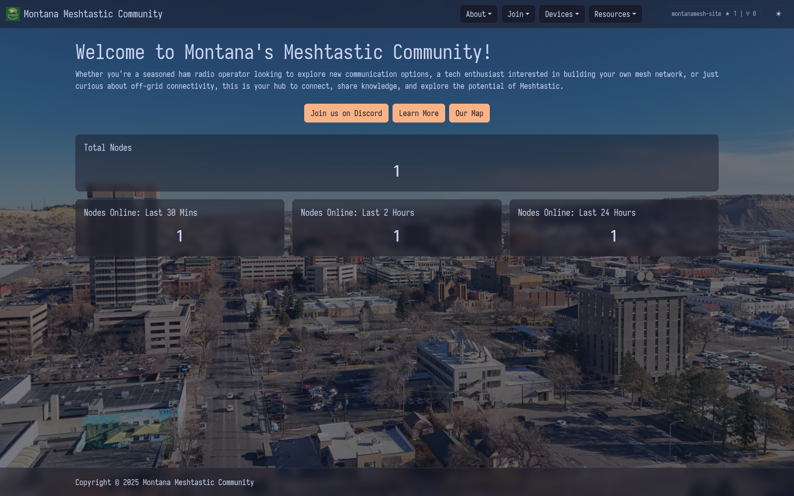

# MontanaMesh Site

ASP.NET Core (`net8.0`) website for the Montana Meshtastic Community.

## What this app does

- Serves the public website pages (`/`, `/connect`, `/devices`, `/host-a-node`, `/setup`, `/recommended-configuration-settings`, `/resources`, `/privacy`).
- Serves `robots.txt` and a custom 404 page for missing routes.
- Exposes a lightweight stats API at `/api/nodes/stats`.
- Reads node stats from `data/node-stats.json`.
- Includes a helper script (`scripts/update-node-stats.sh`) that builds `data/node-stats.json` from MeshMonitor's node DB when mounted, with MontanaMesh MQTT traffic as the fallback source.

## Tech stack

- .NET 8 ASP.NET Core MVC
- Static assets in `wwwroot`
- Optional container runtime with Podman Compose

## Repository setup

This repo is configured to use SSH for GitHub:

```bash
git remote -v
# origin  git@github.com:Montana-Meshtastic-Community/montanamesh-site.git (fetch)
# origin  git@github.com:Montana-Meshtastic-Community/montanamesh-site.git (push)
```

## Run locally with host `dotnet`

### Prerequisites

- .NET SDK 8.x (or newer SDK that can build `net8.0`)
- ASP.NET Core runtime 8.x installed

### Start

```bash
cd montanamesh-site
dotnet run
```

Default dev URL from launch settings:

- `http://localhost:5123`

## Run with Podman Compose

From this directory:

```bash
cd montanamesh-site
podman-compose -f podman-compose.yml up -d --build
podman-compose -f podman-compose.yml ps
```

The container publishes:

- `http://localhost:8080`

Stop:

```bash
podman-compose -f podman-compose.yml down
```

## MQTT node stats updater (optional)

The homepage stats call `/api/nodes/stats`. To keep that file fresh, run:

```bash
cd montanamesh-site
./scripts/update-node-stats.sh
```

The script uses MQTT env vars from the parent repo `.env` when available (`../.env`), samples traffic for a short window, and writes:

- `data/node-stats.json`
- `data/node-database.json`

When `MESHMONITOR_DB_PATH` points at a readable MeshMonitor SQLite DB, `node-stats.json` uses distinct IDs from MeshMonitor's `nodes` table for `totalNodes` and the 30-minute, 2-hour, and 24-hour windows. The MQTT-derived `node-database.json` is still updated so the site has a fallback source if the MeshMonitor DB is not mounted.

Relevant settings:

- `MQTT_STATS_BROKER_URL` defaults to `mqtt://mqtt5:1883` in the master-control stack; standalone script fallback is `mqtt://127.0.0.1:1883`
- `MQTT_STATS_TOPIC` defaults to `msh/US/#`
- `MQTT_STATS_TLS` defaults to `false`
- `MQTT_STATS_SAMPLE_SECONDS` defaults to `60`
- `MESHMONITOR_DB_PATH` enables MeshMonitor DB-backed counts when set to a readable SQLite DB path
- `NODE_STATS_DATA_DIR` can override the output directory

In the master-control stack, the `node-stats-updater` service samples the local `mqtt5` broker over the Compose network every 5 minutes and mounts the MeshMonitor data volume read-only at `/meshmonitor`. Homepage counts come from `/meshmonitor/meshmonitor.db` when available; otherwise, `totalNodes` falls back to the unique node set in `data/node-database.json`.

## Screenshots

Home page screenshot:



## Basic deployment notes

1. Build/test locally:

```bash
dotnet build
```

2. Choose runtime:
- Host process with system `dotnet`, or
- Container using `Dockerfile` + `podman-compose.yml`.

3. Put a reverse proxy (Caddy/Nginx) in front for TLS and domain routing.

4. Ensure persistent storage for `data/` if you want node history retained across restarts.
